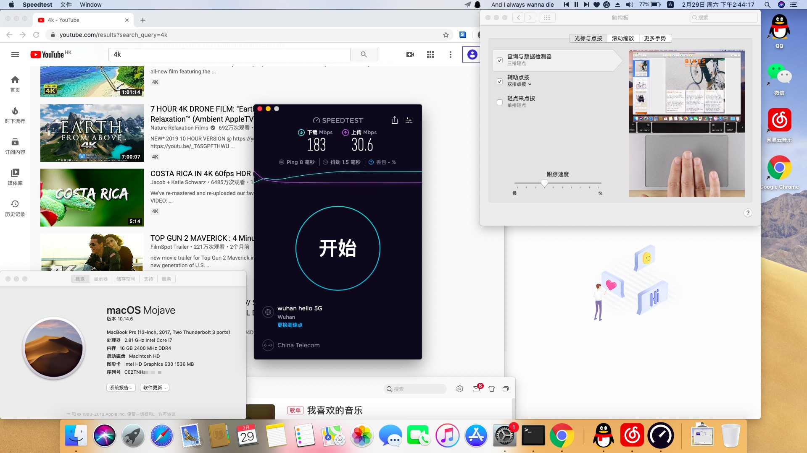

# OMEN by HP Laptop 15-ce0xx

### **👌The following is the content provided by Google Translate, which is inconvenient for you, please forgive me!**

### 😜This EFI is basically OK, and feedback is welcome!

English(当前)|<a href="https://github.com/besscroft/HP-OMEN-3-Hackintosh/blob/master/zh_CN_README.md">中文</a>

### Configuration

| HP OMEN 3  | OMEN by HP Laptop 15-ce0xx                |
| ---------- | ----------------------------------------- |
| BIOS       | F.20 Rev.A                                |
| CPU        | Intel(R) Core(TM) i7-7700HQ CPU @ 2.80GHz |
| GPU        | NVIDIA GeForce GTX 1050                   |
| GPU        | Intel(R) HD Graphics 630                  |
| Sound card | ALC295                                    |
| Disk       | HP SSD EX950 512G、HGST 1T                |

### No problem

- Sound card is normal, keyboard can adjust sound
- Camera is normal
- Touchpad is normal
- Sleeping and awakening are normal. It is normal to close the lid and open it again. I don't know what a white apple is, but I tried it many times and found no problem.
- Battery is OK
- Wired network card is normal
- Brightness is normal, but cannot be adjusted with the keyboard, it can be adjusted in the settings（I have to look for posts again😓

### Invalid function

- Nvidia graphics card is blocked because it cannot be driven
- Bluetooth
- Wifi  :(

### Some reference tutorials

[黑苹果教程](https://hexo.52bess.com/clover.html)

[HP暗影精灵3安装 macOS 10.14.3 Mojave 记录](https://mp.weixin.qq.com/s/oPAwyR9WafBcg0N-raPWYw)

[macOS Mojave黑苹果教程！](https://mp.weixin.qq.com/s/st7feN-yHfDcvCEngvbIEw)

[【黑果小兵】macOS Mojave 10.14.6 18G87 正式版 with Clover 5050原版镜像[双EFI双平台终极版]](https://blog.daliansky.net/macOS-Mojave-10.14.6-18G87-Release-version-with-Clover-5033-original-image.html)

远景论坛[修改dsdt实现电量显示方法（整理修改已有帖子）](http://bbs.pcbeta.com/viewthread-1778499-1-1.html)

tonymacx86[HP OMEN 15-dc电池错误](https://www.tonymacx86.com/threads/solved-hp-omen-15-dc-battery-error.263814/#post-1841023)

[[指南]如何修补DSDT的工作电池状态](https://www.tonymacx86.com/threads/guide-how-to-patch-dsdt-for-working-battery-status.116102/)

### Download link Mirror sync upload

👍The image is from the blog of @黑果小兵's blog, and I use this image myself!

XunLei Offline (BT) download：[[请点击下载](https://mirrors.dtops.cc/iso/MacOS/10.14/daliansky_macos/macOS%20Mojave%2010.14.6%2818G84%29%20Installer%20with%20Clover%205027.dmg)] Thanks to`@难忘情怀`for downloading resources

Http Download link:[[请点击下载](https://mirrors.dtops.cc/iso/MacOS/daliansky_macos/)] Thanks to`@难忘情怀`for downloading resources

`BaiDuCloud link`: <https://pan.baidu.com/s/1yx7A_wlfepp6ybTCRcz4cg> `Extraction code`: `qrwt`

MD5 (macOS Mojave 10.14.6(18G84) Installer with Clover 5027.dmg) = af934738cd02c4cefacf527d23532289

### Acknowledgement(thank、gratitude)

- Thank you hackers for the open source.
- Thanks to the tutorials provided by the Vision Forum and the image of [黑果小兵](https://github.com/daliansky)。

### Common problem

**Q:How to enter BIOS or set boot items?**

A:After booting, press the `ESC` key, and then follow the instructions to select

**Q:Failed to wipe?**

A:See if the EFI partition is too small, generally 200M or more is recommended.Especially note here that some people will fail to wipe the disk and Windows 10 will not be accessible. I do n’t know what the reason is, but it is recommended to check how others operate before installation to avoid some misunderstanding.At the same time: **Remember to back up in advance! **

**Q:This install "macOS xxxx" application copy is damaged and cannot be used to install macOS**

A:The reason is that the certificate in the old macOS installation image has expired and Apple has not updated the certificate date.Open the terminal and change the time:` date 0201010116`

### 🔊Solutions if speakers are not available

The sound card for OMEN 3 is ALC295. Find the `VoodooHDA-295.pkg` I provided in the repo and install it.I'm lazy and only provide this one solution, Google provides you a better solution, just to see how you choose!

### Contact me

Email：631908942#qq.com

QQ group：821557332

If you have any suggestions, welcome feedback!