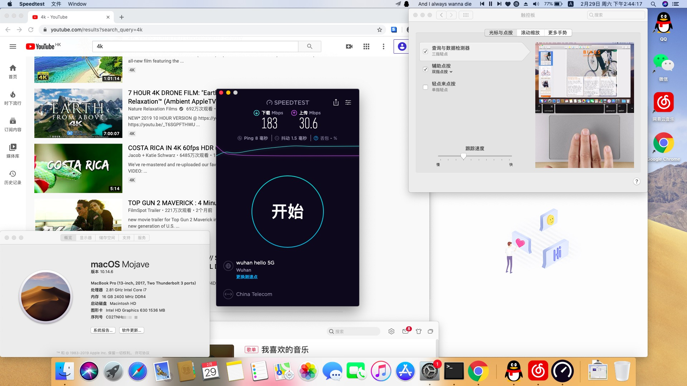

# OMEN by HP Laptop 15-ce0xx

### 😜此EFI基本OK，不足之处欢迎反馈！

<a href="https://github.com/bessyjl/HP-OMEN-3-Hackintosh">English</a>|中文(当前)

### 配置

| 产品名称暗影精灵3 | OMEN by HP Laptop 15-ce0xx                |
| ----------------- | ----------------------------------------- |
| BIOS              | F.20 Rev.A                                |
| 处理器            | Intel(R) Core(TM) i7-7700HQ CPU @ 2.80GHz |
| 独立显卡          | NVIDIA GeForce GTX 1050                   |
| 显卡              | Intel(R) HD Graphics 630                  |
| 声卡              | ALC295                                    |
| 硬盘              | HP SSD EX950 512G、HGST 1T                |

### 没问题的

- 声卡正常，键盘可以调声音
- 摄像头正常
- 触摸板正常
- 睡眠和唤醒正常，合上盖子再打开也正常，我不知道白苹果是怎样的，但是我试了很多次，没发现问题。
- 电池正常
- 有线网卡正常
- 亮度正常，但是不能用键盘调整，在设置里面可以调整（我得再去爪巴帖子了😓

### 无效功能

- 独显因为不能驱动，所以屏蔽
- 蓝牙
- WiFi  :(

### 一些参考教程

[黑苹果教程](https://blog.52bess.com/posts/2019/clover.html)

[HP暗影精灵3安装 macOS 10.14.3 Mojave 记录](https://mp.weixin.qq.com/s/oPAwyR9WafBcg0N-raPWYw)

[macOS Mojave黑苹果教程！](https://mp.weixin.qq.com/s/st7feN-yHfDcvCEngvbIEw)

[【黑果小兵】macOS Mojave 10.14.6 18G87 正式版 with Clover 5050原版镜像[双EFI双平台终极版]](https://blog.daliansky.net/macOS-Mojave-10.14.6-18G87-Release-version-with-Clover-5033-original-image.html)

远景论坛[修改dsdt实现电量显示方法（整理修改已有帖子）](http://bbs.pcbeta.com/viewthread-1778499-1-1.html)

tonymacx86[HP OMEN 15-dc电池错误](https://www.tonymacx86.com/threads/solved-hp-omen-15-dc-battery-error.263814/#post-1841023)

[[指南]如何修补DSDT的工作电池状态](https://www.tonymacx86.com/threads/guide-how-to-patch-dsdt-for-working-battery-status.116102/)

### 下载链接 镜像同步上传中

👍**镜像来自于@黑果小兵的博客找的链接，我自己用的也是这个镜像！**

迅雷离线下载：[[请点击下载](https://mirrors.dtops.cc/iso/MacOS/10.14/daliansky_macos/macOS%20Mojave%2010.14.6%2818G84%29%20Installer%20with%20Clover%205027.dmg)] 感谢`@难忘情怀`提供下载资源

http下载链接:[请点击下载](https://mirrors.dtops.cc/iso/MacOS/daliansky_macos/) 感谢`@难忘情怀`提供下载资源

百毒云：链接: <https://pan.baidu.com/s/1yx7A_wlfepp6ybTCRcz4cg> 提取码: `qrwt`

MD5 (macOS Mojave 10.14.6(18G84) Installer with Clover 5027.dmg) = af934738cd02c4cefacf527d23532289

### 致谢

- 感谢各位大佬的开源。
- 感谢远景论坛的各位大佬提供的教程，以及[黑果小兵](https://github.com/daliansky)的镜像。

### 常见问题

**Q:如何进入BIOS或者设置启动项？**

A:开机后按下ESC键，然后根据指引选择

**Q:抹盘时失败**

A:看看是不是EFI的分区给的太小了，一般建议200M以上。这里尤其注意，有的人抹盘失败会导致Windows10进不去，我不知道原因是什么，但是建议在安装之前，多去看看别人怎么操作的，避免一些误区，同时：**记得提前备份！！！**

**Q:安装时提示这个“安装 macOS xxxx”应用程序副本已损坏，不能用来安装macOS**

A:原因是旧版macOS 安装镜像中的证书过期，并且苹果没有更新证书日期。你打开终端，改一下时间就好了：` date 0201010116`

### 🔊如果扬声器无法使用的解决方案

暗影精灵3的声卡是ALC295，找到我在repo中提供的`VoodooHDA-295.pkg`，并安装它。我很懒，只提供了这一种方案，Google给您提供了更好的方案，只是看您怎么选了！

### 联系我

Email：631908942#qq.com

QQ群：821557332

如果大家有一些建议，也欢迎反馈！
